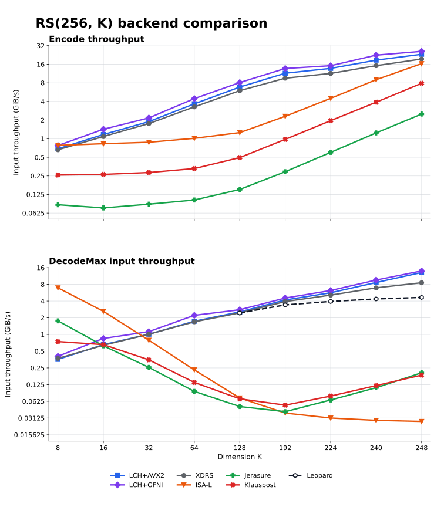

# Galois

Practical library for some common algorithms over $\mathbb{F}_{2^8}$.

## Lin-Chung-Han variant of Reed-Solomon codes

The [Lin-Chung-Han (LCH) transform](https://arxiv.org/abs/1404.3458) is an
additive FFT-like transform over fields $\mathbb{F}_{2^m}$. For an $RS(n, k)$
code, it enables practical encoding and erasure decoding in
$\mathcal{O}(n\log\min(k, n-k))$ time. A canonical implementation is
[Leopard-RS](https://github.com/catid/leopard). This library provides:

- XDRS-derived low- and high-rate LCH decoders.
- Arbitrary positive data/recovery dimensions whose normalized power-of-two
  mother code fits 256 symbols.
- Fine-tuned AVX2 and [GFNI](https://builders.intel.com/docs/networkbuilders/galois-field-new-instructions-gfni-technology-guide-1-1639042826.pdf) kernels.

High-rate codewords use Leopard-compatible encoding.

### Benchmarks

Performance comparison of $RS(256, k)$ implementations:



[Open the benchmark report on GitHub Pages](https://malkovsky.github.io/galois/).

## Build

```bash
cmake --preset release
cmake --build --preset release
ctest --preset release
```
